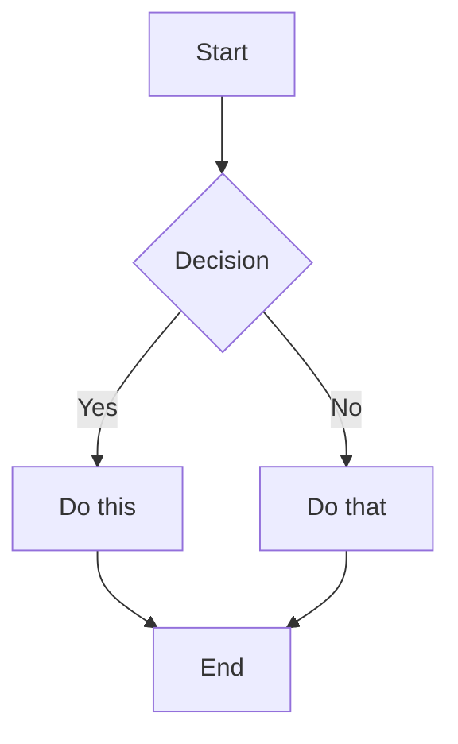

# Mermaid Test

## Simple Diagram

## VS Code Support

### Built-in Preview
- Use Markdown Preview (Ctrl+Shift+V or Cmd+Shift+V)
- Mermaid renders in preview since VS Code 1.70+

### Extensions for Better Support
1. **Markdown Preview Mermaid Support** - Adds mermaid to preview
2. **Mermaid Editor** - Live preview while editing
3. **Mermaid Markdown Syntax Highlighting** - Syntax colors

### Alternative: PlantUML
- Requires extension but very powerful
- Better IDE integration
- Can export to various formats